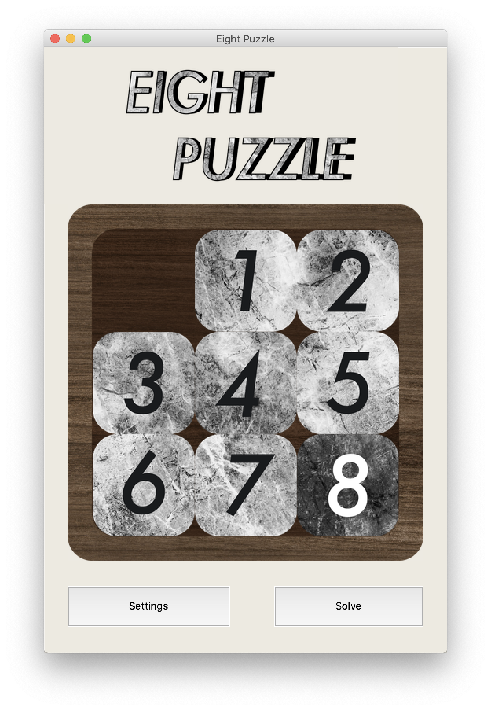
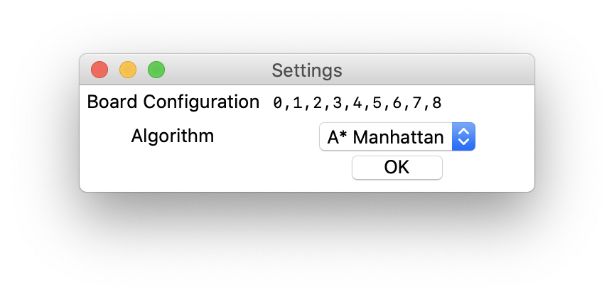
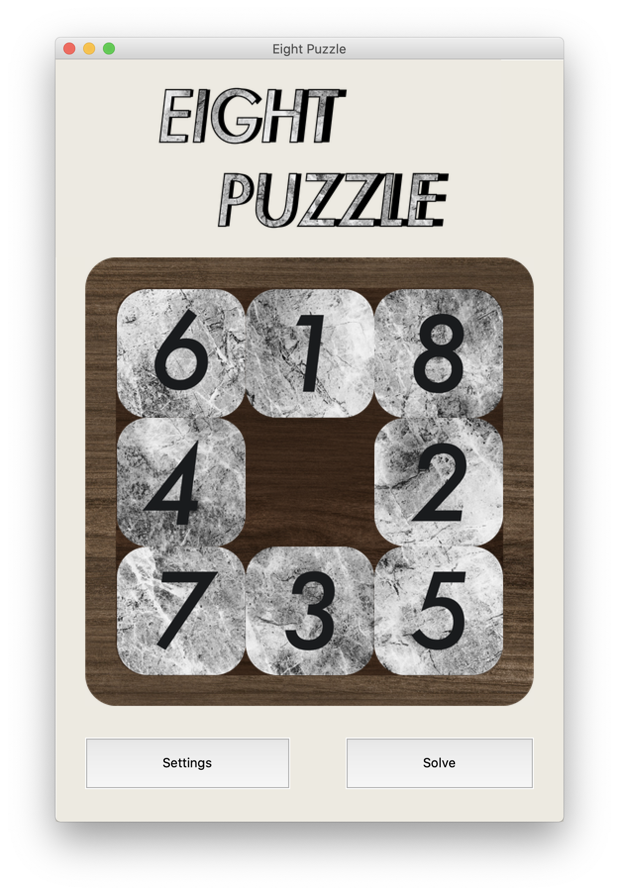

# Eight Puzzle
An agent to solve the 8-puzzle game.

## Introduction
<p>An instance of the N-puzzle game consists of a board holding N = m^2 − 1 (m = 3, 4, 5, ...) distinct movable tiles, plus an empty space. The tiles are numbers from the set {1, …, m^2 − 1}. For any such board, the empty space may be legally swapped with any tile horizontally or vertically adjacent to it. In this assignment, we will represent the blank space with the number 0 and focus on the m = 3 case (8-puzzle).</p>
<p>Given an initial state of the board, the combinatorial search problem is to find a sequence of moves that transitions this state to the goal state; that is, the configuration with all tiles arranged in ascending order ⟨0, 1, …, m^2 − 1⟩. The search space is the set of all possible states reachable from the initial state.</p>
<p>The blank space may be swapped with a component in one of the four directions {‘Up’, ‘Down’, ‘Left’, ‘Right’}, one move at a time. The cost of moving from one configuration of the board to another is the same and equal to one. Thus, the total cost of path is equal to the number of moves made from the initial state to the goal state.</p>


## Content
1. [Datastructures used](#data-structures-used)
    - [Stack](#stack)
    - [Queue](#queue)
    - [Heap](#heap)
2. [Algorithms used](#algorithms-used)
    - [BFS](#breadth-first-search)
    - [DFS](#depth-first-search)
    - [A*](#a-search)
3. [How to use](#how-to-use)
    - [driver.py](#driverpy)
    - [game.py](#gamepy)
4. [Output](#output)
5. [GUI](#graphical-user-interface)
    - [How to use](#how-to-use-1)
6. [Sample runs](#sample-runs)

## Data structures used

### Stack
<p>Stack is a linear data structure which follows a particular order in which theoperations are performed. The order is last in first out.</p>
<p>A stack shall be implemented for the DFS. As python does not have an object stack therefore we used the ‘list’ object so when the search method called is DFS, the function push (in the Frontier class.) uses the normal append which can work as a typical push function for a stack while the pop (in the frontier class.) calls the normal function python pop that acts as a normal stack pop and pops out the last in object.</p>

### Queue
<p>A queue is a collection of entities that are maintained in a sequence and can be modified by the addition of entities at one end of the sequence and the removal of entities from the other end of the sequence (FIFO). It should be implemented for the BFS As python does not have an object queue therefore we used the ‘list’ object so when the search method called is BFS, the function push (in the Frontier class.) uses the normal append which can work as a typical enqueue function while the pop (in the frontier class.) calls the normal function python pop(0) that acts as a dequeue and pops the first in object out.</p>

### Heap
<p>A heap is a specialized tree-based ds which is essentially an almost complete tree that satisfies the heap property: in a max heap, for any given node C, if P is a parent node of C, then the key (the value) of P is greater than or equal to the key of C and less than/equal for min heap. The node at the "top" of the heap is called the root node. The import ‘heapq’ is used so the tree based ds can be used for the A* search. A heap shall be implemented for this search so when the search method called is A*, the function push (in the Frontier class.) calls the heappush function which is specified for that import while the pop (in the frontier class.) calls the function heappop that is customized for heaps as well.</p>


## Algorithms used

### Breadth first search
```
function BFS(initial_state, goalTest)
    frontier = queue.new(initial_state)
    explored = set.new()
    
    while frontier:
        state=frontier.dequeue() explored.add(state)
        
        if goalTest(state):
            return SUCCESS(state)
            
        for neighbor in state.neighbors():
            if neighbor not in frontier UNION explored:
                frontier.enqueue(neighbor)
    return FAILURE
```

### Depth first search
```
function DFS(initial_state,goalTest)
    frontier = stack.new(initial_state)
    explored = set.new()
    
    while frontier:
        state=frontier.dequeue()
        explored.add(state)
        
        if goalTest(state):
            return SUCCESS(state)
            
        for neighbor in state.neighbors():
            if neighbor not in frontier UNION explored:
                frontier.enqueue(neighbor)
    return FAILURE
```

### A* search
```
function AStar(initial_state,goalTest)
  frontier = heap.new(initial_state)
  explored = set.new()
  
  while frontier:
    state=frontier.deleteMin()
    explored.add(state)
    
    if goalTest(state):
        return SUCCESS(state)
        
    for neighbor in state.neighbors():
        if neighbor not in frontier UNION explored:
            frontier.insert(neighbor)
        else if neighbor in frontier:
            frontier.decreaseKey(neighbor)
  return FAILURE
```

## How to use
There are 2 two files; driver.py and game.py

### driver.py
- We have to use the command line : python3 driver.py method_name initial_board_configuration
- For the method_name we have 4 different methods that can be used: ‘bfs’, ‘dfs’, ‘ast_euc’ or ‘ast’. (ast is the abbreviation for the A* search using Manhattan’s cost calculations)
- For the initial board configuration we should enter our stating puzzle like : 1,2,5,3,4,0,6,7,8 which is then solved to 0,1,2,3,4,5,6,7,8.

So for an example the command line should look like the following line: python3 driver.py bfs 1,2,5,3,4,0,6,7,8

### game.py
To run our GUI which is the file game.py (which will be explained later on in the GUI section)

## Output
The output is written to a text file ‘output.txt’ on the following format, and is also printed to the terminal
```
Algorithm: [Algorithm used]
Cost of path: [Cost of path]
Nodes expanded: [Number of expanded nodes]
Search depth: [Search depth of the solution]
Max search depth: [Maximum search depth reached] Running time: [Time taken to find the solution]
Max RAM usage: [Memory used by the program]
Path to goal: ['Left', 'Up', 'Up', ..., 'Right', 'Down']
```

## Graphical user interface


### How to use
-	By running the file game.py inside the view module.
-	The logic of the game is pretty much the same to the real game.
-	Clicking on any moveable tile moves it to the available empty space.
-	To change the board configuration or the search method, click on the settings button and a popup window will appear.
  
  
-	To input a new board configuration simply enter the new configuration separated by commas and no spaces into the text area (correct input format is assumed)
-	To change the search algorithm, choose from the one you want from the drop-down menu
-	After that click OK and the changes will take place
-	To make the puzzle solve itself just click the Solve button and observe

## Sample runs

1.	When the initial state is 6,1,8,4,0,2,7,3,5:


#### BFS: 
Solve using:
-	python3 driver.py bfs 6,1,8,4,0,2,7,3,5
-	From the GUI

*Output:*
```
Algorithm: BFS
Cost of path: 20
Nodes expanded: 54094
Search depth: 20
Max search depth: 21
Running time: 0.89686849 msec
Max RAM usage: 201.55859375 MB
Path to goal: ['Down', 'Right', 'Up', 'Up', 'Left', 'Down', 'Right', 'Down', 'Left', 'Up', 'Left', 'Up', 'Right', 'Right', 'Down', 'Down', 'Left', 'Left', 'Up', 'Up']
```

#### DFS
Solve using:
- python3 driver.py dfs 6,1,8,4,0,2,7,3,5
-	From the GUI

*Output:*
```
Algorithm: DFS
Cost of path: 46142
Nodes expanded: 51015
Search depth: 46142
Max search depth: 46142
Running time: 0.79567673 msec
Max RAM usage: 215.55078125 MB
Path to goal: ['Up', 'Left', 'Down', 'Down', ..., 'Left', 'Up', 'Left']
Path to goal is trimmed because it is so large
```

#### A* Manhattan
Solve using:
-	python3 driver.py ast 6,1,8,4,0,2,7,3,5
-	From the GUI

*Output:*
```
Algorithm: A* Manhattan
Cost of path: 20
Nodes expanded: 517
Search depth: 20
Max search depth: 20
Running time: 0.01853529 msec
Max RAM usage: 187.34375 MB
Path to goal: ['Down', 'Right', 'Up', 'Up', 'Left', 'Down', 'Right', 'Down', 'Left', 'Up', 'Left', 'Up', 'Right', 'Right', 'Down', 'Down', 'Left', 'Left', 'Up', 'Up']
```

#### A* Euclidean
-	python3 driver.py ast_euc 6,1,8,4,0,2,7,3,5
-	From the GUI

*Output:*
```
Algorithm: A* Euclidean
Cost of path: 20
Nodes expanded: 846
Search depth: 20
Max search depth: 20
Running time: 0.04070098 msec
Max RAM usage: 187.34375 MB
Path to goal: ['Down', 'Right', 'Up', 'Up', 'Left', 'Down', 'Right', 'Down', 'Left', 'Up', 'Left', 'Up', 'Right', 'Right', 'Down', 'Down', 'Left', 'Left', 'Up', 'Up']
```
<br/>
2.	When the initial state is 8,6,4,2,1,3,5,7,0:


#### BFS:
-	python3 driver.py bfs 8,6,4,2,1,3,5,7,0
-	From the GUI
 
*Output:*
```
Algorithm: BFS
Cost of path: 26
Nodes expanded: 166786
Search depth: 26
Max search depth: 27
Running time: 3.03948402 msec
Max RAM usage: 189.1015625 MB
Path to goal: ['Left', 'Up', 'Up', 'Left', 'Down', 'Right', 'Down', 'Left', 'Up', 'Right', 'Right', 'Up', 'Left', 'Left', 'Down', 'Right', 'Right', 'Up', 'Left', 'Down', 'Down', 'Right', 'Up', 'Left', 'Up', 'Left']
```

#### DFS
-	python3 driver.py dfs 8,6,4,2,1,3,5,7,0
-	From the GUI

*Output:*
```
Algorithm: DFS
Cost of path: 9612
Nodes expanded: 9869
Search depth: 9612
Max search depth: 9612
Running time: 0.14956959 msec
Max RAM usage: 18.16796875 MB
Path to goal: ['Up', 'Up', 'Left', 'Down', 'Down', ..., 'Up', 'Up', 'Left']
Path to goal is trimmed because it is so large
```

#### A* Manhattan
-	python3 driver.py ast 8,6,4,2,1,3,5,7,0
-	From the GUI

*Output:*
```
Algorithm: A* Manhattan
Cost of path: 26
Nodes expanded: 1167
Search depth: 26
Max search depth: 26
Running time: 0.03914766 msec
Max RAM usage: 7.078125 MB
Path to goal: ['Left', 'Up', 'Up', 'Left', 'Down', 'Right', 'Down', 'Left', 'Up', 'Right', 'Right', 'Up', 'Left', 'Left', 'Down', 'Right', 'Right', 'Up', 'Left', 'Down', 'Down', 'Right', 'Up', 'Left', 'Up', 'Left']
```

#### A* Euclidean
-	python3 driver.py ast_euc 8,6,4,2,1,3,5,7,0
-	From the GUI

*Output:*
```
Algorithm: A* Euclidean
Cost of path: 26
Nodes expanded: 3721
Search depth: 26
Max search depth: 26
Running time: 0.16693743 msec
Max RAM usage: 9.9296875 MB
Path to goal: ['Left', 'Up', 'Left', 'Up', 'Right', 'Right', 'Down', 'Left', 'Left', 'Up', 'Right', 'Right', 'Down', 'Left', 'Down', 'Left', 'Up', 'Up', 'Right', 'Down', 'Down', 'Right', 'Up', 'Left', 'Left', 'Up']
```
